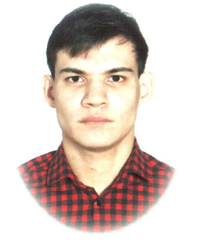

# Насипов Ринат Варисович

Я работаю в компании "БКЕ" инженером-энергетиком 1 категории. Получал высшее образование по специальности "Электроэнергетика и электротехника". Закончил сначала бакалавриат, а далее и магистратуру по этой же специальности. Имею водительское удостоверение категорий B и С. Во время учёбы в университете активно занимался научной деятельностью, имею множество публикаций, получал научную стипендию.  Во время рабочей деятельности принимал участие в конкурсе молодежных научно-технических разработок. Также активно занимаюсь спортом.

### Мои навыки:
* Знание правил электробезопасности; 
* Знание принципов работы энергооборудования, теплового оборудования, высоковольтных вакуумных выключателей, компрессоров воздушного давления, схем управления асинхронных двигателей, электродвигателей с фазным ротором, частотно-регулируемых приводов; 
* Знание и умение программирования и конфигурирования промышленных логических контроллеров;
* Чтение и составление монтажных и принципиальных схем;
* Английский – средний уровень (Intermediate);
* Продвинутый пользователь ПК;
* Чтение и составление монтажных и принципиальных схем;
* Работа с оргтехникой (факс, модем, копировальные аппараты, сканеры, принтеры).

